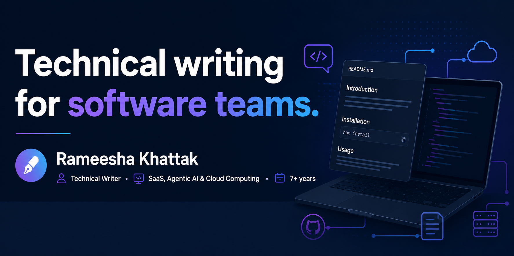

I write the documentation, technical content, and developer-facing resources that help software products get understood, adopted, and maintained.

This portfolio is built as docs-as-code using Markdown and Git because good documentation should be treated like software.

## What I Write

- **Technical documentation** - SRS documents, user manuals, help center content
- **Technical blogs** - SaaS, AI, automation, and cloud topics
- **Books** - published and ghostwritten technical books
- **Conversion copy** - landing pages and website copy for SaaS companies
- **API and docs-as-code content** - Markdown-first workflows

## Tools I Work With

Markdown · Git & GitHub · n8n · Strapi · React & Tailwind CSS · AWS · Claude & AI-assisted workflows

## Featured Work

### Documentation
- **Software Requirements Specification for a government system (ITELAA, KPITB)** - complete SRS for digitizing paper-based Police/Levies station filing: fifteen registers, user classes, interfaces, and nonfunctional requirements. [View SRS (PDF)](./Sanitized_Itella_srs.pdf)

- **User Manual for a government web application (KPITB)** - step-by-step manual for the Company Evaluation Form, from required documents and login through all five form steps. [View User Manual (PDF)](Sanitized_User_manual_for_Company_evalution_form.pdf)

### Books
- **Technical books on cloud computing and IT service management** - self-published AWS certification guides on Amazon KDP, plus ghostwritten titles on ITIL 4 and global project management. [View books](./books/)

### Blogs
- **SEO-optimized technical blogs for a Germany-based SaaS company** - published pieces on agentic AI workflows, SDaaS, and AI-generated code quality, backed by keyword research and SERP analysis. [View blogs](./blogs/)

### Articles
- **Workflow documentation article** - what to document in an n8n automation before handing it to another developer, published on Dev.to. [Read the article](https://dev.to/meesha_khattak/i-built-an-invoice-approval-workflow-in-n8n-heres-what-id-document-before-handing-it-to-another-374p)

### Copywriting
- **Full Website Content Strategy & Rewrite** - audited and rewrote copy across all pillar pages with on-page SEO. 
Sample: the homepage rebuilt as a working mockup (company name fictionalized). [View homepage mockup](https://rameeshakhattak.github.io/portfolio/Homepage_Mockup_Software_Company.html))

### Automation
- **n8n invoice approval workflow** - n8n invoice approval workflow - end-to-end automated approval workflow integrating AI extraction, JSON parsing, and Slack notifications with emoji-based approval routing. [View workflow sample (PDF)](Workflow_%26_Notification_Logic_RameeshaPortfolio.pdf) 

## Work With Me

I'm available for freelance technical writing projects: documentation, technical blogs, and website copy for SaaS and software teams.

- [LinkedIn](https://linkedin.com/in/rameeshakhattak) for recommendations and posts
- [Dev.to](https://dev.to/meesha_khattak) for published articles
- [Upwork](https://www.upwork.com/freelancers/~0159fe77b479aea15f) to hire me
