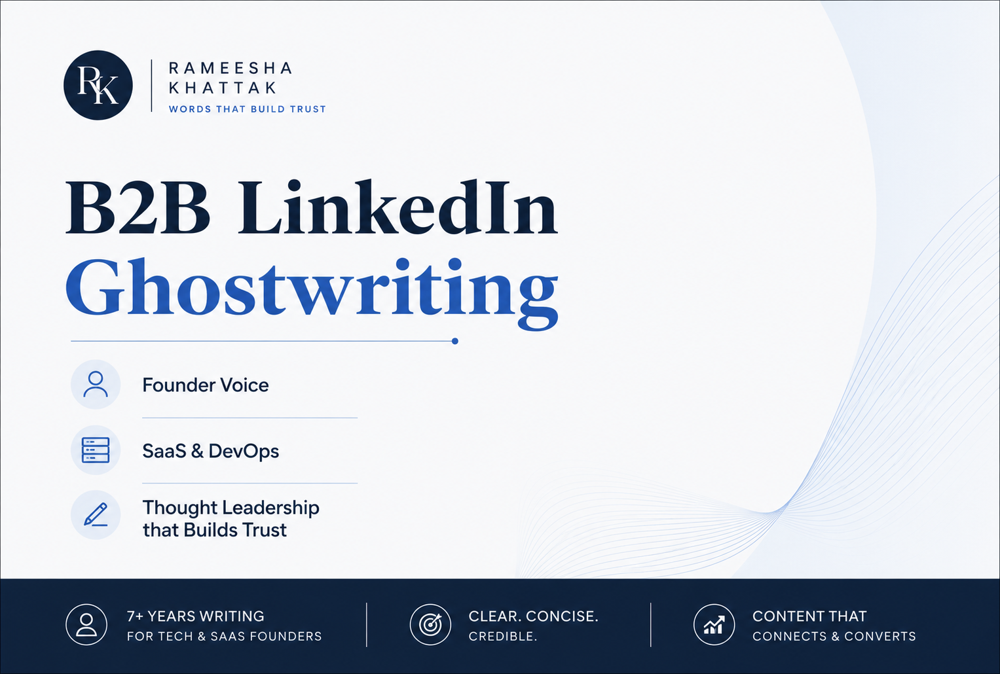

# B2B LinkedIn Ghostwriting

Ghostwritten LinkedIn content for founders and technical leaders across SaaS, DevOps, and cloud, written in each client's own voice for a B2B audience.

Technical founders usually have strong opinions but little time to shape them into content that lands with senior buyers. Working from a short brief or a set of raw ideas, I turn those opinions into clear, credible posts that build authority and open real conversations, without sounding generic or AI-written.

This work also includes managing a Germany-based SaaS company's LinkedIn presence for two years.

Samples are shared with permission. All client work is kept confidential.

## Samples

- **Platform Engineering or DevOps With a New Name?** - what separates a real platform team from a rebranded DevOps team, and why adoption is the real measure of success. Ghostwritten for a DevOps consulting client. [View sample (PDF)](./Platform_vs_DevOps.pdf)

- **The Bottleneck Isn't Your Pipeline** - why waiting on environments costs more than build speed, and how self-service infrastructure removes the ticket instead of processing it faster. Ghostwritten for a DevOps consulting client, approved by their CEO. [View sample (PDF)](./Self_Service_Infrastructure.pdf)
